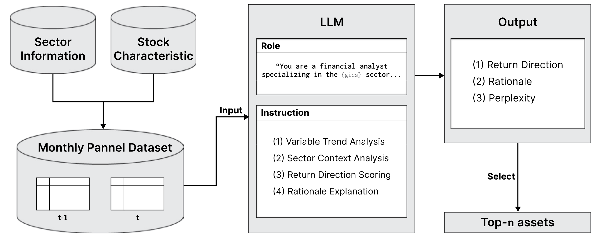

<p align="center">
  <h2 align="center"><strong>Large Language Models as Financial Analysts: Sector-Aware Reasoning</strong></h2>
  <h3 align="center"><strong>Computational Economics (2026)</strong></h3>
</p>

<p align="center">
  <a href="https://rdcu.be/e4Ynd">📄 Paper</a> &nbsp;|&nbsp;
  <a href="https://link.springer.com/article/10.1007/s10614-026-11329-4">🔗 Springer</a>
</p>

<!-- Optional: add a figure under CE/SectorLLM/assets/overview.png -->
<!--
<p align="center">
  
</p>
-->

<br/>

This repository provides the **official implementation of a sector-aware LLM framework for asset selection**, introduced in:

> Kim, H., Jeong, J., Ko, H. et al. *Large Language Models as Financial Analysts: Sector-Aware Reasoning for Investment Decisions.* **Computational Economics** (2026). DOI: 10.1007/s10614-026-11329-4

## 📢 Updates

- **2026**: Code released.

## 🔍 Framework Overview

We predict **next-month return direction** using a **sector-conditioned LLM prompt**.
For each asset *i* at month *t*, we provide firm characteristics from `t-1` and `t` plus its GICS sector, and the LLM outputs:

- **Return Movement Score** `p̂ ∈ [0, 1]` (≥ 0.5 indicates expected increase)
- **Rationale** explaining the return-risk trade-off under the sector context

**Sector-aware prompting**
- The prompt assigns the model a role: *"a financial analyst specializing in the {GICS sector} sector."*
- Inputs are presented in a structured table format with a glossary of variable definitions.
- Inference uses `temperature = 0` for deterministic outputs.

**Data (paper setting)**
- Universe: S&P 500 constituents (Jan 2012 – Dec 2021), 293 firms, 35,160 firm-month observations
- Features: 21 firm characteristics (momentum, liquidity, risk, valuation) + GICS sector
- Preprocessing: cross-sectional median imputation, monthly rank normalization to `[-1, 1]`

**Portfolio construction**
- Each month, assets are ranked by `p̂` and the top-*n* are selected.
- Ties are broken using **perplexity** of the generated rationale (lower = more confident).
- Selected assets form long-only portfolios with mean-variance optimization (max Sharpe / min variance).

## Getting Started

### 🛠️ Environment Setup

```bash
git clone https://github.com/damilab/SectorLLM.git
cd SectorLLM

conda env create -f environment.yml
conda activate sector
```

### 📁 Data Preparation

Place the following files in `data/`:

- `llm_questions_2012_2021.csv` - Monthly prompts for LLM input
- `question_features_2011_2021.csv` - Features table for merging (key: `permno, year, month`)
- `prices_2012_2021.csv` - Price data for backtests
- `permno_monthly_meta.csv` - Monthly metadata (`prc`, `ret`, `shrout`, etc.)

See [data/README.md](data/README.md) for details.

### 🤖 LLM Inference

Run sector-aware prompting with vLLM (default: Llama 3 8B Instruct).

```bash
python vllm/run.py --data-dir data --output-dir vllm/outputs
```

By default, this runs two prompt variants:
- **With sector**: Sector-specific analyst role using GICS
- **Without sector**: Generic analyst role (ablation)

### 📊 Score Extraction

Parse JSONL outputs and merge with features.

```bash
python vllm/json2csv.py --input-dir vllm/outputs --question-csv data/question_features_2011_2021.csv
```

### 🚀 Portfolio Backtests

Run backtests with long-only (EW/VW) and mean-variance optimization strategies.

```bash
python portfolio/main.py
```

## 📝 Citation

```bibtex
@article{kim2026llm_sector_aware,
  title   = {Large Language Models as Financial Analysts: Sector-Aware Reasoning for Investment Decisions},
  author  = {Kim, Hyeonjin and Jeong, Jiwoo and Ko, Hyungjin and Lee, Woojin},
  journal = {Computational Economics},
  year    = {2026},
  doi     = {10.1007/s10614-026-11329-4}
}
```
